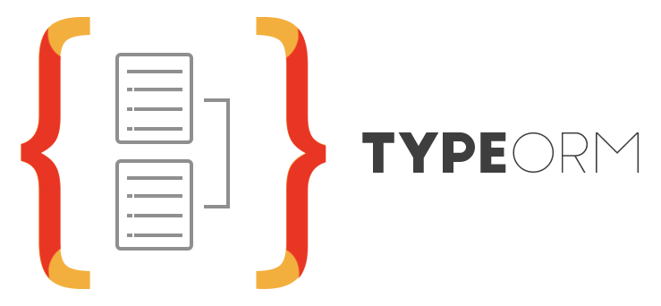

## Sobre

Desenvolvedor de software fullstack apaixonado por Engenharia e Arquitetura de Software. Cursando o 4° Semestre de Sistemas de Informação.

Minha história começou quando tranquei uma faculdade de Direito em 2020 e começei a estudar programação web por conta própria.
Desde então venho me aperfeiçoando nesse universo e ficando cada vez mais empolgado em estudar os tópicos pertinentes da nossa área. 
Eu simplesmente amo a minha profissão.

Atualmente, estou ocupando uma posição de desenvolvedor frontend, utilizando ferramentas como React, TypeScript e MaterialUI, para construção de aplicações web. Porém, já atuo como fullstack em projetos pessoais e freelance, utilizando minha base como frontend e alinhando com meus conhecimentos de NodeJS, API's REST, banco de dados relacionais e banco de dados não relacionais, para a construção de aplicações web fullstack.

Porém, minhas habilidades não se restringem a isso. Possuo raciocínio lógico e analítico para resolver os mais variados problemas do dia-a-dia, além de ser 
uma pessoa extremamente fácil de se ter na equipe. Me misturo fácil e sempre gosto de receber feedbacks, pois sei o quanto isso é importante para a minha evolução.

Estou aberto para oportunidades na modalidade home office. 

Caso não seja exatamente a stack que você procura em um desenvolvedor, saiba que, com certeza eu posso aprender o que você precisa, afinal não é a primeira vez
que preciso aprender algo novo ;)

## Contato

    
  
 
    
     
  

 

## Resumo

  <a href="https://github.com/DevVictor19">
  
  

 

## Principais Stacks

  
  

 
  
## Frontend

  
  
  
  
  
  
  
  
  
  
  

 

## Backend

  
  
  
  
  
  
  

 

## Tests

  

 
  
 

  <h2>🐍 Snake eating my contribution 🐍</h2>
   
  
   
   
   

